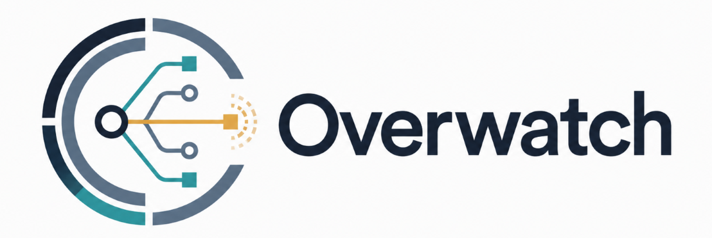
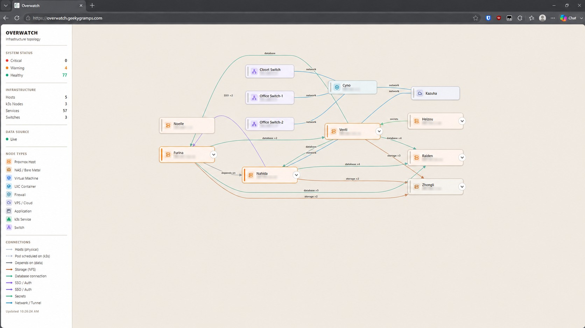
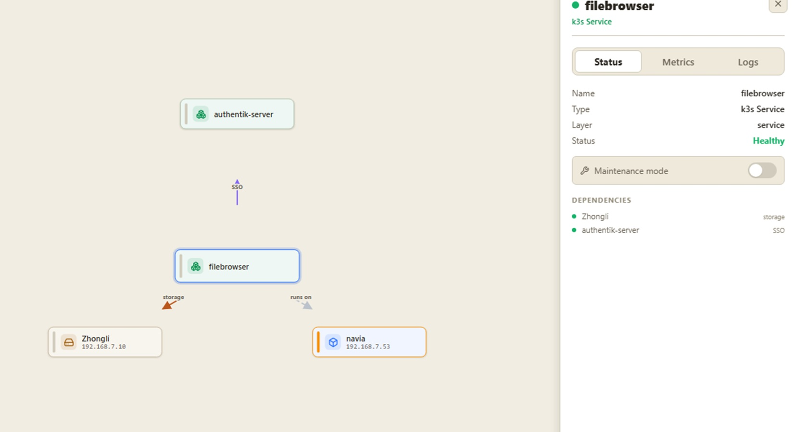
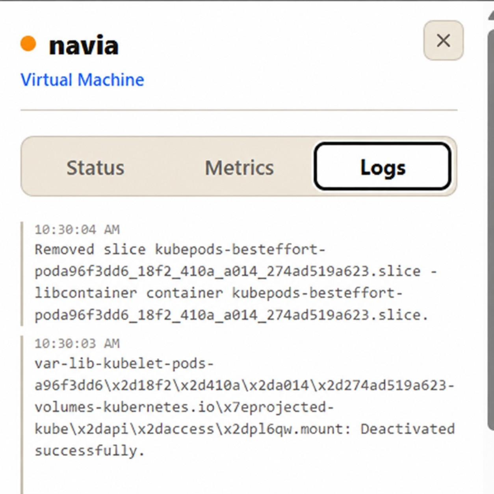
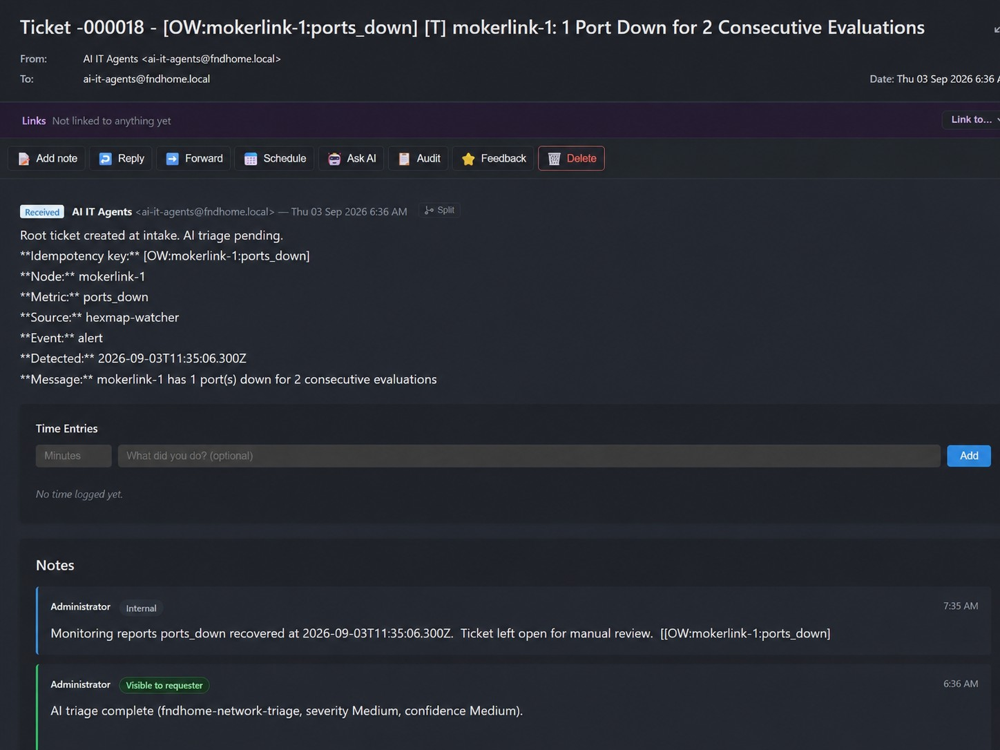
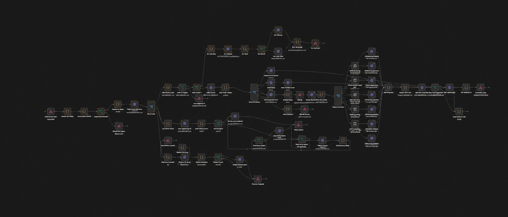

# Overwatch
**Infrastructure topology, observability, dependency-aware alerting, and
AI-assisted incident lifecycle automation.**


Overwatch is an agentless infrastructure topology, observability, and
incident automation platform built for heterogeneous environments
spanning Kubernetes, Proxmox, Docker, networking, storage, identity, and
supporting services.

It continuously discovers infrastructure relationships, builds a live
dependency graph, evaluates health and thresholds, suppresses downstream
noise when an upstream dependency is already failing, and feeds
actionable incidents into an automated triage pipeline.

Overwatch replaces and substantially expands the earlier **HexMap**
prototype.



------------------------------------------------------------------------

## What Overwatch Does

Overwatch provides a live operational model of the environment by
combining infrastructure discovery, topology mapping, health state,
observability, and incident automation.

Core capabilities include:

-   Agentless infrastructure discovery
-   Dependency graph generation
-   Proxmox, Kubernetes, Docker, network, storage, identity, and secret
    relationship discovery
-   Health and threshold evaluation
-   Dependency-aware alert suppression
-   Maintenance mode at host, VM, service, and workload level
-   Re-alert / recheck handling for persistent conditions
-   Recovery detection and ticket updates
-   Loki-backed live log retrieval
-   Metrics integration
-   Automated incident creation
-   AI-assisted triage
-   Idempotent ticket handling
-   Flood protection
-   Human review before final incident closure

------------------------------------------------------------------------

## Architecture

``` text
Infrastructure Sources
        |
        v
   Overwatch Discovery
        |
        +-- Proxmox API
        +-- Kubernetes API
        +-- Docker
        +-- Authentik
        +-- Infisical
        +-- NFS mounts
        +-- SNMP
        +-- Linux/runtime inspection
        +-- Network relationships
        +-- Service metadata
        +-- Additional infrastructure APIs
        |
        v
   Dependency Graph
        |
        +-- hosts / runs-on
        +-- storage / database
        +-- SSO / identity
        +-- secrets
        +-- network relationships
        |
        v
   Health / Threshold Engine
        |
        +-- consecutive-evaluation thresholds
        +-- dependency-aware suppression
        +-- maintenance mode
        +-- rechecks / re-alerts
        +-- recovery detection
        +-- dead-man's-switch monitoring
        |
        v
      n8n
        |
        v
   Incident Intake Pipeline
        |
        +-- idempotency
        +-- event routing
        +-- flood control
        +-- AI triage routing
        +-- recovery updates
        |
        v
     FreeITSM
```

------------------------------------------------------------------------

## Infrastructure Discovery

Overwatch automatically rebuilds its dependency graph from multiple
sources on a recurring interval.

Current discovery sources include:

-   Proxmox
-   Kubernetes / k3s
-   Docker
-   Authentik
-   Infisical
-   NFS mount inspection
-   SNMP
-   Linux/runtime inspection
-   Network relationships
-   Service metadata
-   Additional infrastructure APIs

The result is a unified model of:

-   Physical hosts
-   Hypervisors
-   Virtual machines
-   Containers
-   Kubernetes services and workloads
-   Managed switches
-   Network relationships
-   Storage dependencies
-   Database dependencies
-   Authentication dependencies
-   Secret bindings
-   Service-to-service dependencies

------------------------------------------------------------------------

## Topology Visualization


The frontend uses automatic graph layout to render the live
infrastructure model.

Features include:

-   Automatic node placement
-   Typed directional edges
-   Aggregated relationship counts
-   Collapsible host and cluster groups
-   Click-to-focus dependency views
-   Service drill-down panels
-   Health state indicators
-   Dependency and dependent lists
-   Metrics and logs tabs
-   Maintenance mode controls

Focused views allow a selected resource to be pulled out of the larger
topology and displayed with its real upstream and downstream
relationships.



------------------------------------------------------------------------

## Observability

Overwatch integrates operational telemetry directly into the topology.

### Metrics

Health and threshold evaluation can use infrastructure and service
metrics to detect persistent conditions.

Thresholds support consecutive evaluations to avoid firing incidents on
brief spikes.

### Logs

Node and workload logs are pulled live from Loki.

Current log sources include:

-   Kubernetes pod logs
-   systemd journals
-   Grafana Alloy-collected host logs

Logs are presented in the selected resource's drill-down view so
operators can move from topology to evidence without leaving the
interface.



------------------------------------------------------------------------

## Dependency-Aware Alerting

Overwatch does not treat every alert as an independent failure.

If a downstream service is unhealthy because an upstream dependency is
already failing, Overwatch can suppress the downstream symptom while
allowing the root issue to remain active.

``` text
Storage failure
    |
    v
Application becomes unhealthy
    |
    v
Application alert suppressed
    |
    v
Storage incident remains active
```

This reduces alert storms and keeps operators focused on likely root
causes.

------------------------------------------------------------------------

## Maintenance Mode

Maintenance mode can be applied at multiple resource levels:

-   Host
-   Virtual machine
-   Kubernetes node
-   Kubernetes service
-   Pod / workload

This allows planned work to suppress expected alerts without disabling
monitoring for unrelated infrastructure.

A service can be placed into maintenance while its host, storage,
identity provider, and neighboring workloads remain fully monitored.


------------------------------------------------------------------------

## Incident Lifecycle

Overwatch tracks the lifecycle of an incident rather than creating a new
ticket every time the same threshold fires.

``` text
NEW
  |
  v
TRIAGED
  |
  v
RECHECK / RE-ALERT
  |
  v
ACTIVE / SUPPRESSED
  |
  v
RECOVERED
  |
  v
HUMAN REVIEW
```

The same incident remains identifiable throughout its lifetime.



------------------------------------------------------------------------

## Idempotent Ticketing

Overwatch uses a stable incident key:

``` text
[OW:{node}:{metric}]
```

Example:

``` text
[OW:mokerlink-1:ports_down]
```

The intake workflow searches for an existing matching incident before
creating a new ticket.

This prevents duplicate incidents for the same persistent condition.

The design was introduced after an early version generated approximately
**900 duplicate tickets** and unnecessary LLM usage during a single
night. The failure drove a redesign around deterministic idempotency,
event routing, flood protection, and constrained AI execution.

------------------------------------------------------------------------

## Rechecks and Re-alerts

Persistent conditions are appended to the existing incident as recheck
events.

``` text
Initial alert:
shenhe memory > 90%

Recheck:
96.4%

Recheck:
95.2%

Recheck:
96.1%
```

These updates remain attached to the same incident rather than creating
additional tickets.

This preserves the history of the condition while keeping the incident
queue clean.


------------------------------------------------------------------------

## Recovery Handling

When the monitored condition clears, Overwatch updates the existing
incident instead of opening or closing tickets blindly.

``` text
Port down detected
    |
    v
Ticket created
    |
    v
AI triage added
    |
    v
Port recovers
    |
    v
Existing ticket updated
    |
    v
Ticket remains open for manual review
```

Recovery is treated as evidence that the condition stopped, not proof
that the underlying cause is permanently resolved.

This keeps final incident disposition human-governed.

------------------------------------------------------------------------

## AI-Assisted Triage

Firing incidents can be passed through an AI triage pipeline.

A lightweight routing model selects one of several domain specialists:

-   Network
-   Proxmox
-   Kubernetes
-   Storage
-   Database
-   Security
-   Incident

Each specialist receives:

-   Sanitized alert context
-   Infrastructure metadata
-   Relevant topology relationships
-   Live diagnostic output
-   Logs and metrics when available

The agent is constrained to evidence-backed structured output.

Triage results include:

-   Severity
-   Confidence
-   Summary
-   Findings
-   Recommended next actions

If diagnostics are unavailable, the agent is expected to reduce
confidence rather than fabricate certainty. Severity reflects the
observed condition; confidence reflects the quality of evidence
available for diagnosis.

------------------------------------------------------------------------

## Incident Automation Pipeline

The n8n `ai-it-agents-alert-intake` workflow handles alert lifecycle
events.

It supports:

-   Alert creation
-   Suppressed events
-   Resolved events
-   Discovery-health events
-   Exact idempotency matching
-   Reopen grace periods
-   Per-node/metric flood guards
-   Orphan handling
-   AI specialist routing
-   Structured triage
-   Ticket updates
-   Re-triage on stale incidents

The workflow is designed to fail safely and avoid unnecessary AI calls
when deterministic logic is sufficient.



------------------------------------------------------------------------

## Design Philosophy

### Deterministic Logic Before AI

AI is used where reasoning adds value. Idempotency, event routing,
suppression, thresholds, maintenance handling, and lifecycle state are
handled deterministically rather than delegated to an LLM.

### AI Should Explain Uncertainty

If live diagnostics fail, confidence should drop. The system should
never pretend to have evidence it does not have.

### Incidents Have Lifecycles

A persistent fault is not a new incident every evaluation cycle.
Overwatch maintains a stable incident identity and records subsequent
state changes against it.

### Topology Is Operational Context

The dependency graph is not just visualization. Infrastructure
relationships influence alert suppression, focused investigation, triage
context, and incident behavior.

### Suppress Symptoms, Not Visibility

Dependency-aware suppression reduces redundant downstream incidents
without disabling the monitoring that detected those symptoms.

### Maintenance Should Be Scoped

Planned work on one service should not require disabling monitoring for
an entire host or environment.

### Humans Remain in Control

Recovery does not automatically mean closure. Automation gathers
evidence, correlates state, performs triage, and updates the incident.
Final operational decisions remain human-governed.

------------------------------------------------------------------------

## Current Environment

Overwatch currently monitors a homelab environment of roughly **90
discovered infrastructure and service nodes** across:

-   Proxmox
-   k3s
-   Docker
-   Managed switches
-   Bare-metal systems
-   Virtual machines
-   Storage
-   Identity
-   Secrets
-   Monitoring services
-   Application services

The environment intentionally contains heterogeneous infrastructure so
the platform has to model relationships across different technologies
rather than assuming a single orchestration or cloud platform.

------------------------------------------------------------------------

## Technology Stack

### Backend

-   Node.js
-   Express
-   SQLite

### Infrastructure / Discovery

-   Proxmox API
-   Kubernetes API
-   Docker
-   SNMP
-   Linux runtime inspection
-   Authentik
-   Infisical
-   NFS

### Observability

-   Prometheus
-   Grafana
-   Grafana Alloy
-   Loki

### Automation

-   n8n

### Incident Management

-   FreeITSM

### AI

-   Multi-agent triage
-   Lightweight domain routing
-   Domain-specific specialist agents
-   Live diagnostic context
-   Structured evidence-backed output
-   Confidence-aware analysis

### Visualization

-   Dagre automatic graph layout
-   Browser-based topology UI
-   Typed directional dependency edges
-   Collapsible infrastructure groups
-   Focused dependency views

------------------------------------------------------------------------

## Evolution from HexMap

HexMap started as an agentless infrastructure discovery and
visualization prototype.

Overwatch expands that idea into an operational platform with:

-   Live discovery
-   Dependency modeling
-   Health state
-   Logs
-   Metrics
-   Alert evaluation
-   Dependency-aware suppression
-   Resource-scoped maintenance controls
-   Incident lifecycle management
-   Persistent-condition rechecks
-   Recovery handling
-   AI-assisted triage
-   Ticket automation

HexMap answered:

> **What exists, and how is it connected?**

Overwatch adds:

> **What is unhealthy, why does it matter, what else depends on it, is
> this the same incident, what evidence is available, and what should
> happen next?**

------------------------------------------------------------------------

## From Monitoring to Incident Lifecycle Orchestration

Traditional monitoring systems are very good at identifying individual
conditions:

``` text
CPU > threshold
Memory > threshold
Port down
Service unavailable
```

The operational problem begins after detection.

A single infrastructure failure can produce multiple downstream
symptoms. Persistent conditions can repeatedly generate the same
notification. Planned maintenance can create false incidents. Recovery
can be mistaken for resolution. AI analysis can become expensive or
misleading when it is invoked without deterministic controls or
sufficient evidence.

Overwatch treats these as state and relationship problems.

The dependency graph provides context. The threshold engine determines
whether a condition is persistent enough to matter. Maintenance state
identifies expected disruption. Dependency-aware suppression
distinguishes likely root causes from downstream symptoms. Idempotency
determines whether an event belongs to an existing incident. Rechecks
preserve the history of persistent conditions. Recovery updates the
existing operational record.

AI is introduced only after those deterministic decisions have been
made.

The result is intended to behave less like an alert forwarder and more
like an **incident lifecycle orchestration system**.

------------------------------------------------------------------------

## Failure-Driven Design

One of the most important changes in Overwatch came from an early
failure.

An earlier version of the alert-intake workflow generated roughly **900
duplicate tickets in a single night** while repeatedly invoking
LLM-based processing for events that should have been recognized as the
same underlying condition.

The fix was architectural rather than prompt-based.

The redesigned pipeline introduced:

-   Stable incident identity
-   Exact idempotency matching
-   Deterministic event routing
-   Per-node/metric flood protection
-   Recheck handling
-   Recovery-state handling
-   Reopen grace periods
-   Fail-soft AI triage
-   Evidence-constrained specialist output
-   Reduced AI invocation where deterministic logic is sufficient

The incident became a useful design principle for the project:

## Status

Overwatch is under active development.

Current focus areas include:

-   Broader infrastructure discovery
-   Better alert correlation
-   Improved dependency inference
-   Expanded automated diagnostics
-   Additional incident lifecycle automation
-   Public/demo mode for sanitized screenshots and videos
-   Continued hardening of the AI triage pipeline

------------------------------------------------------------------------

## Why I Built It

I wanted infrastructure monitoring to answer more than:

> **What metric crossed a threshold?**

The real operational questions are:

> **What failed?**

> **What depends on it?**

> **Is this a root cause or a downstream symptom?**

> **Has this happened before?**

> **What evidence is available right now?**

> **Is this still the same incident?**

> **Did the condition recover, or was the underlying problem actually
> resolved?**

> **What should an engineer investigate next?**

Overwatch is my attempt to turn those questions into an operational
system instead of a collection of disconnected dashboards, alerts, and
tickets.
