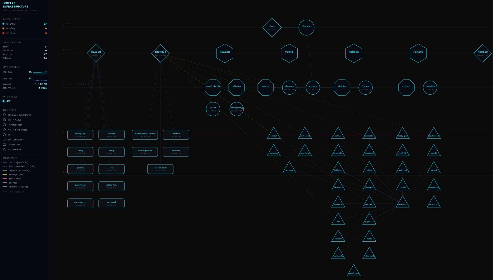

# Hexmap



Status: active
Created: 2026-06-30
Owner: Felton
Builder: Codex (implementation), Claude (architecture/spec)

## Purpose

A 3D layered network topology visualizer for homelab infrastructure. Renders hosts, VMs, k3s pods, and storage/NFS resources as a rotating multi-layer hex grid, with live metrics pulled from Prometheus and logs from Loki. Built as a replacement for a flat dashboard — each infrastructure layer (hosts, VMs, containers, storage) gets its own hex plane, with connections drawn between related nodes across layers.

## Structure

```
frontend/   React + Vite app — 3D hex grid rendering, node detail panels, OIDC login
api/        Express + SQLite backend — discovers topology from infra sources, evaluates node state, caches results
```

## Stack

- **Frontend:** React, Vite, Radix UI, Tailwind
- **Backend:** Node.js, Express, better-sqlite3
- **Auth:** OIDC (Authentik)
- **Metrics/Logs:** Prometheus, Loki

## Notes

This is a personal homelab tool, published for portfolio purposes. It assumes a specific private infrastructure environment (Proxmox, k3s, Prometheus/Loki, an OIDC provider) and isn't set up as a general-purpose deployable product — no public demo or install docs are provided.
